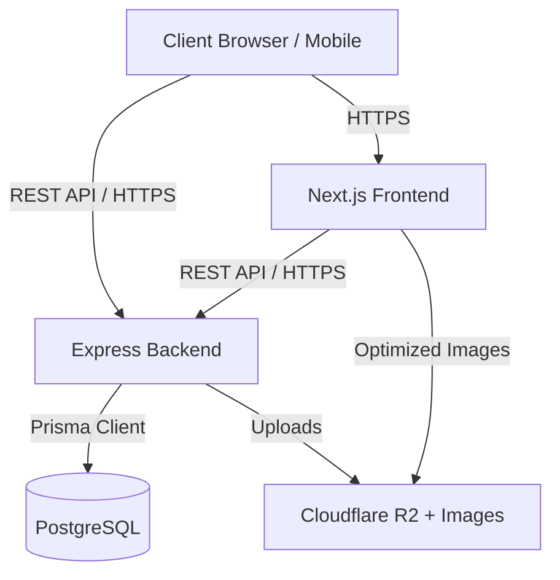

# ARCHITECTURE.md — Promilaa

## 1. System Architecture

Promilaa follows a decoupled **Frontend + Backend** architecture, suitable for independent scaling and distinct deployment environments (Vercel for frontend, managed Node container for backend).



### Components
- **Frontend App (Next.js)**: Responsible for UI, SSR/SSG of product pages (for SEO), client-side cart management, and rendering the Admin Panel. Uses React, Tailwind CSS, shadcn/ui, and Framer Motion.
- **Backend App (Express.js)**: Provides the REST API, enforcing business logic, authentication, and database access. Built with Node.js and TypeScript.
- **Database (PostgreSQL)**: The single source of truth for all structured data (users, products, orders). Managed via Prisma ORM.
- **Media CDN (Cloudflare R2 + Images)**: Handles all image uploads (product photos, payment screenshots) and serves optimized formats (WebP/AVIF) to the frontend.

## 2. Folder Structure

We will use a Monorepo structure (e.g. using npm workspaces or TurboRepo) to keep everything in one repository while maintaining separate build pipelines.

```
/promilaa
├── apps/
│   ├── frontend/               # Next.js App
│   │   ├── src/
│   │   │   ├── app/            # App Router (pages, api routes for Next)
│   │   │   │   ├── (storefront)/ # Public pages
│   │   │   │   └── admin/      # Admin pages
│   │   │   ├── components/     # UI Components (per COMPONENT_LIBRARY.md)
│   │   │   │   ├── ui/         # shadcn primitives
│   │   │   │   ├── shared/
│   │   │   │   ├── storefront/
│   │   │   │   └── admin/
│   │   │   ├── lib/            # Utilities, API client, Tailwind config
│   │   │   └── styles/         # Global CSS
│   │   └── package.json
│   │
│   └── backend/                # Express App
│       ├── src/
│       │   ├── controllers/    # Route handlers
│       │   ├── middleware/     # Auth, roles, error handling
│       │   ├── routes/         # Express routers (matches API_SPEC.md)
│       │   ├── services/       # Business logic
│       │   └── index.ts        # App entry point
│       ├── prisma/
│       │   ├── schema.prisma   # Database schema
│       │   └── seed.ts         # Dummy data generation
│       └── package.json
├── package.json                # Monorepo root
└── README.md
```

## 3. Module Boundaries & Key Design Decisions

### 3.1. Authentication
- **Decision**: JWT with Access + Refresh Token pair.
- **Why**: Allows stateless API validation (fast) while maintaining session control via long-lived, rotatable refresh tokens.
- **Mapping**: Matches `AUTH_FLOW.md` and `API_SPEC.md` (`/auth/*` routes).

### 3.2. Order & Payment Flow
- **Decision**: Server-side pricing enforcement. Client cart is ephemeral.
- **Why**: Security. The client cannot dictate prices or shipping fees (fixed ৳60/৳100). The backend calculates the absolute truth upon order placement.
- **Mapping**: Maps to `ORDER_FLOW.md` and `DATABASE_SCHEMA.md` (`Order`, `OrderItem`, `Payment`).

### 3.3. Bangladesh-Specific Payments (Manual)
- **Decision**: Mobile wallet payments (bKash, Nagad, etc.) are tracked via a `Payment` record with `status = PENDING_VERIFICATION`. Customers upload a screenshot directly via a secure endpoint to Cloudflare R2.
- **Why**: Ensures no unverified orders are shipped. Keeps the system modular so future gateway integrations (SSLCommerz) can just update the `Payment.status` automatically without changing the order state machine.
- **Mapping**: Maps to `COD_PAYMENT_FLOW.md` and `API_SPEC.md` (`/orders/:orderNumber/payment-proof`).

### 3.4. Admin Panel Architecture
- **Decision**: Served by the Next.js frontend, but JS bundle is code-split from the storefront.
- **Why**: Performance. Storefront users don't download heavy admin table/chart libraries. Admin routes (`/admin/*`) are role-gated server-side on data requests, but client-side redirects provide the UX.

## 4. Reconciled Milestone Breakdown

This sequence merges `DEVELOPMENT_ORDER.md` with `TASK_LIST.md`. Each milestone has a hard stop for review.

| Milestone | Scope | Dependencies |
|-----------|-------|--------------|
| **M1: Repo & Tooling** | Monorepo setup, Next.js + Express scaffold, linting/TS config, DB connection. | None |
| **M2: Database Schema & Seed** | Prisma schema implementation, migrations, dummy data seed script. | M1 |
| **M3: Auth (Backend)** | JWT generation, refresh rotation, role-middleware, login/register endpoints. | M2 |
| **M4: Catalog APIs** | CRUD for categories, products, variants, images + Cloudflare R2 + Images integration. | M3 |
| **M5: Design System & Core UI**| Tailwind tokens, shadcn setup, shared components (buttons, layout shell, inputs). | M1 |
| **M6: Storefront Catalog UI** | Homepage, Collection pages, PDP, using real APIs and seed data. | M4, M5 |
| **M7: Orders & Payments API** | Order placement, server-side totals, stock decrement, payment proof endpoints. | M4 |
| **M8: Cart & Checkout UI** | Client cart, multi-step checkout form, payment method logic, confirmation. | M6, M7 |
| **M9: Account Area UI** | Order history, address book, wishlist. | M8 |
| **M10: Admin Panel** | Layout, Product/Category/Order management, **Payment Verification Queue**. | M7, M9 |
| **M11: Polish (SEO, Perf, A11y)**| Metadata, JSON-LD, Lighthouse audit fixes, accessibility pass. | M10 |
| **M12: QA & Launch Prep** | Execute `TESTING_CHECKLIST.md`, security review, deployment to staging/prod. | M11 |

*Note: Work within a milestone must be fully completed and reviewed before proceeding to the next.*
